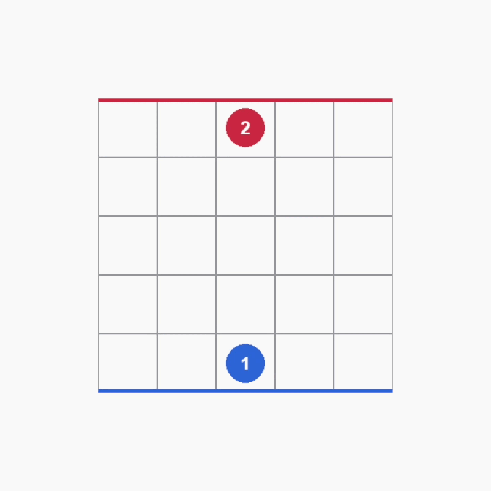

# Learning Mini-Quoridor with an AlphaZero-Style Agent

This repository contains a from-scratch AlphaZero-style reinforcement learning
pipeline applied to **Mini-Quoridor**, a reduced version of the board game
Quoridor played on a `5x5` board with `4` walls per player.

The project was developed as a proof of concept: the goal is not to reproduce
DeepMind-scale AlphaZero, but to implement the core ideas of self-play,
Monte Carlo Tree Search, and policy-value neural networks in a smaller strategic
domain.

<p align="center">
  
</p>

## Project Overview

Quoridor is a deterministic two-player board game where each player tries to
reach the opposite side of the board while placing walls to slow down the
opponent. Even on a reduced `5x5` board, the game remains strategically
interesting: an agent must learn when to move directly toward the goal, when to
place walls, and how to escape blocked positions.

The implemented agent learns entirely from self-play. At each move, Monte Carlo
Tree Search improves the raw neural-network policy; after each game, the final
outcome is used to train a convolutional policy-value network.


## Main Components

| File | Purpose |
|---|---|
| `game/game_logic_Ai.py` | Mini-Quoridor environment, legal moves, wall rules, canonical states, winner detection. |
| `game/model.py` | PyTorch policy-value CNN used by MCTS and training. |
| `game/mcts.py` | AlphaZero-style MCTS with PUCT selection and root visit-count policies. |
| `game/agent.py` | Self-play agent wrapper, replay buffer, policy masking, checkpoint saving. |
| `game/alphazero_training.py` | Self-play training loop, metrics, timeout adjudication, plotting hooks. |
| `train_alphazero.py` | Script entrypoint for training with editable hyperparameters. |
| `quoridor_alphazero_notebook.ipynb` | Jupyter notebook used for experiments and training runs. |
| `arena_alphazero.py` | Arena for comparing two trained checkpoints with separate MCTS settings. |
| `play_vs_ai.py` | Pygame demo where a human can play against a trained model. |

## Game Representation

The neural network receives a player-centric tensor with six planes:

1. Current player position
2. Opponent position
3. Horizontal walls
4. Vertical walls
5. Current player remaining walls
6. Opponent remaining walls

The action space has `48` action slots:

- `16` movement actions, including normal moves, jumps, and diagonal jumps
- `32` wall-placement actions, split between horizontal and vertical walls

Illegal actions are masked before being used by the network or MCTS.

## Training

Training is based on self-play. For each move:

1. MCTS searches from the current position.
2. Root visit counts are converted into a target policy.
3. An action is sampled from the MCTS distribution.
4. The state and policy target are stored.
5. At the end of the game, value targets are assigned from the winner.
6. The policy-value network is trained from replay examples.

The project also includes timeout adjudication for games that hit the maximum
step limit. Instead of treating every unfinished game as a full draw, the code
can assign a weak value target based on shortest-path distance to the goal.

## Results

Several runs were tested with different MCTS simulations, exploration constants,
temperature schedules, and timeout handling. The most stable run among the
tested configurations used:

```text
board_size = 5
max_walls = 4
num_simulations = 600
c_puct = 3.5
temperature = 1.0
temperature_after_drop = 0.0
temperature_drop_step = 8
timeout_adjudication_value = 0.3
num_filters = 32
root_dirichlet_alpha = 0.15
root_dirichlet_epsilon = 0.15
batch_size = 128
```

This run achieved:

```text
Games: 500
Average steps: 20.55
Timeouts: 13 / 500 = 2.6%
Average policy loss: 1.366
Average value loss: 0.385
```

## Comparing Checkpoints

Run the arena:

```powershell
.\venv\Scripts\python.exe .\arena_alphazero.py
```

The arena alternates which model plays as Player 1 and supports separate
hyperparameters for each agent, including:

- number of MCTS simulations
- `c_puct`
- move temperature
- temperature after drop
- temperature drop step

This is useful for comparing whether a checkpoint is stronger because of the
neural network itself or because of a more favorable search configuration.

## Play Against the Model

Run the human-vs-AI demo:

```powershell
.\venv\Scripts\python.exe .\play_vs_ai.py
```

The demo lets the user choose the AI search budget:

| Difficulty | MCTS simulations per AI move |
|---|---:|
| Easy | 20 |
| Medium | 200 |
| Challenging | 1000 |
| Hard | 10000 |

Controls:

```text
M      move mode
W      wall mode
H/V    wall orientation
Space  toggle wall orientation
R      restart
Esc    quit
```

## Setup

Create and activate a virtual environment, then install dependencies:

```powershell
python -m venv venv
.\venv\Scripts\activate
pip install -r requirements.txt
```

The main dependencies are:

- Python
- PyTorch
- NumPy
- Matplotlib
- Pygame
- Jupyter Notebook

## Notes and Limitations

This implementation targets a reduced `5x5` version of Quoridor to keep training
feasible on limited hardware. The learned agents show meaningful movement and
wall-placement strategies, but some stalled positions can still occur,
especially when an agent must take a long detour around walls. This is probably
due to a combination of limited network capacity, sparse terminal rewards, and
the fact that the current input representation does not explicitly encode global
path information. As a result, the agent can sometimes recognize that blocking is
useful without fully learning how to recover from the blocked position.

Future improvements could include:

- deeper or wider policy-value networks
- shortest-path feature planes as additional network inputs
- explicit repetition detection
- more systematic arena evaluation
- scaling the environment toward full `9x9` Quoridor
